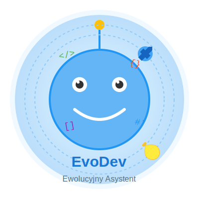
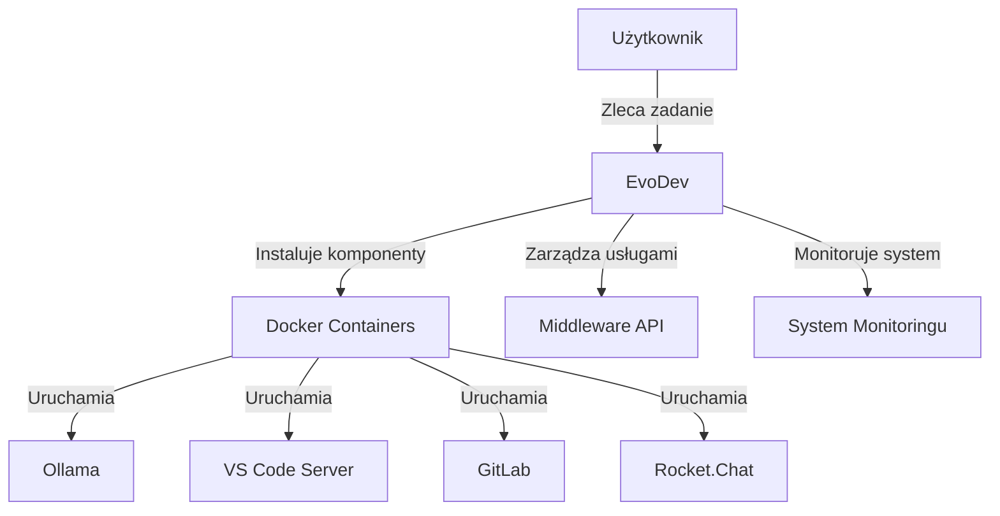

# EvoDev - Ewolucyjny Asystent dla Programistów

<div align="center">
  
  <br>
  <em>Automatyczna instalacja, konfiguracja i rozwój umiejętności dla środowisk programistycznych</em>
</div>

## Spis Treści
- [📋 Przegląd](#przegląd)
- [🚀 Szybki Start](#szybki-start)
- [📦 Instalacja](#instalacja-i-konfiguracja-projektu)
- [🔧 Konfiguracja](#konfiguracja-środowiska)
- [🖥️ System Monitorowania](#system-monitorowania)
- [🏗️ Architektura](#architektura-systemu)
- [💡 Funkcje](#kluczowe-funkcje)
- [📚 Dokumentacja](#dokumentacja)
- [🛠️ Rozwój](#rozszerzanie-systemu-o-nowe-skille)


## Przegląd

EvoDev to asystent ewolucyjny dla programistów. Uczy się nowych umiejętności (skilli) poprzez automatyczną instalację i konfigurację nowego oprogramowania (np. przez Docker Compose).



## Szybki Start

```bash
# Klonowanie repozytorium
git clone <adres_repozytorium>
cd EvoDev

# Uruchomienie systemu
./run.sh

# Uruchomienie monitora z widokiem logów
./run.sh --logs

# Zatrzymanie wszystkich usług
./stop.sh
```

## System Monitorowania

System monitorowania EvoDev zapewnia:
- Monitorowanie zasobów systemowych (CPU, RAM, dysk)
- Śledzenie statusu kontenerów Docker
- Przeglądanie logów systemowych
- Powiadomienia o problemach

### Interfejs Monitora

Monitor jest dostępny pod adresem: `http://localhost:8080`


### Przeglądarka Logów

Dostęp do przeglądarki logów:
- Poprzez monitor: `http://localhost:8080/logs`
- Bezpośrednio: `./run.sh --logs`


## Architektura Systemu

EvoDev składa się z dwóch redundantnych rdzeni i piaskownicy do testowania:

```
┌───────────────┐     ┌───────────────┐
│     Core1     │     │     Core2     │
│  (Aktywny)    │◄────┤  (Standby)    │
└───────┬───────┘     └───────────────┘
        │
        ▼
┌───────────────┐
│   Sandbox     │
│ (Testowanie)  │
└───────────────┘
```

Główne komponenty:
- **Ollama**: Lokalne modele LLM
- **VS Code Server**: Środowisko programistyczne
- **Middleware API**: Zarządzanie usługami
- **GitLab**: Kontrola wersji i CI/CD
- **Rocket.Chat**: Komunikacja i wydawanie poleceń

## Instalacja i Konfiguracja Projektu

### 1. Klonowanie repozytorium

```bash
git clone <adres_repozytorium>
cd EvoDev
```

### 2. Instalacja zależności systemowych

#### Linux (Fedora/Ubuntu/Arch)

```bash
sudo bash install.sh
```

#### Windows (PowerShell)

```powershell
./install.ps1
```

### 3. Konfiguracja środowiska

1. Skopiuj plik `.env.example` jako `.env`:
   ```bash
   cp .env.example .env
   ```
2. Uzupełnij klucz API do LLM (np. OpenRouter):
   ```env
   LLM_API_KEY_TEST=sk-test-1234
   ```

### 4. Instalacja projektu jako pakiet Pythona (tryb developerski)

```bash
pip install -e .
```

### 5. Uruchomienie systemu

```bash
./run.sh
```

## Kluczowe Funkcje

- **Automatyczna konfiguracja środowiska**: System automatycznie instaluje i konfiguruje wszystkie potrzebne komponenty
- **Redundantne rdzenie**: Dwa rdzenie (Core1, Core2) zapewniają wysoką dostępność i możliwość testowania
- **Piaskownica**: Bezpieczne testowanie nowych funkcjonalności bez wpływu na środowisko produkcyjne
- **Rozszerzalność**: Łatwe dodawanie nowych umiejętności poprzez API
- **Monitorowanie**: Kompleksowy system monitorowania zasobów i logów
- **Głosowa interakcja**: Możliwość sterowania systemem przez polecenia głosowe

## Dokumentacja

Szczegółowa dokumentacja dostępna w katalogu `docs/`:

- [📖 Architektura Systemu](docs/3.md): Komponenty, klasy, przykłady kodu
- [📖 Etapy Ewolucji](docs/4.md): Rozwój systemu i przykłady użycia
- [📖 Plan Implementacji](docs/5.md): Struktura katalogów, zarządzanie usługami Docker
- [📖 System Rdzeniowy](docs/6.md): System przywracania, integracja z GitLab CI/CD
- [📖 Redundantne Rdzenie](docs/7.md): Koncepcja dwóch rdzeni, sandbox testowy
- [📖 Infrastruktura Terraform](docs/8.md): Implementacja infrastruktury
- [📖 System Monitorowania](docs/monitoring-system.md): Architektura monitora, przepływ danych, rozwiązywanie problemów

## Struktura Projektu

```
.
├── docker-compose.yml       # Definicje usług Docker
├── run.sh                   # Skrypt uruchamiający system
├── stop.sh                  # Skrypt zatrzymujący system
├── .env                     # Zmienne środowiskowe
├── modules/                 # Moduły infrastruktury
│   ├── core/                # Moduł rdzeniowy
│   ├── sandbox/             # Środowisko testowe
│   └── services/            # Usługi wspierające
├── middleware-api/          # API zarządzające usługami
├── monitor/                 # System monitorowania
│   ├── app.py               # Aplikacja Flask do monitorowania
│   ├── requirements.txt     # Zależności monitora
│   ├── static/              # Pliki statyczne (CSS, JS)
│   └── templates/           # Szablony HTML
├── recovery-system/         # System odzyskiwania
├── data/                    # Dane systemowe
│   ├── logs/                # Logi systemowe
│   ├── backups/             # Kopie zapasowe
│   └── system_db/           # Baza danych systemu
├── docs/                    # Dokumentacja
│   ├── images/              # Grafiki i diagramy
│   ├── monitoring-system.md # Dokumentacja systemu monitorowania
│   └── [...]               # Pozostałe dokumenty
└── tests/                   # Testy
```

## Rozszerzanie Systemu o Nowe Skille

Aby dodać nową funkcjonalność (np. obsługę głosu, OCR, powiadomienia):
1. Wydaj polecenie przez Rocket.Chat (np. "Chcę rozmawiać głosowo").
2. System automatycznie zainstaluje wymagane biblioteki i przeprowadzi test.
3. Po pozytywnym teście funkcja jest gotowa do użycia.

## Przykład Interakcji

- System: "Podaj klucz API do LLM (np. OpenRouter)."
- Użytkownik: "sk-xxxx..."
- System: "Instaluję obsługę głosu... Powiedz coś do mikrofonu..."
- System: "Voice-chatbot gotowy do użycia!"