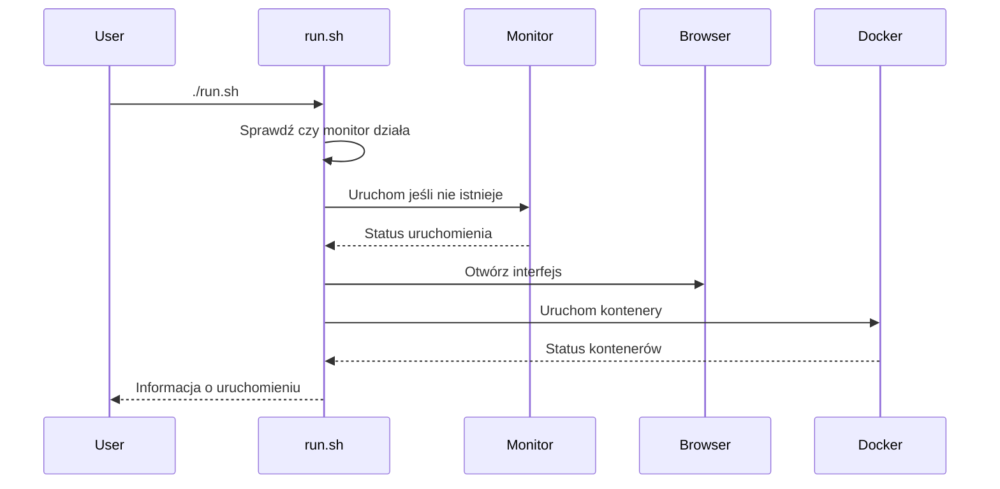
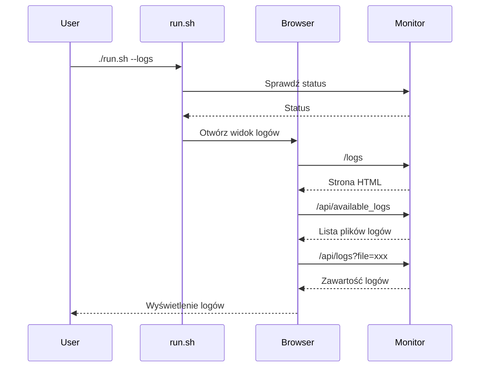
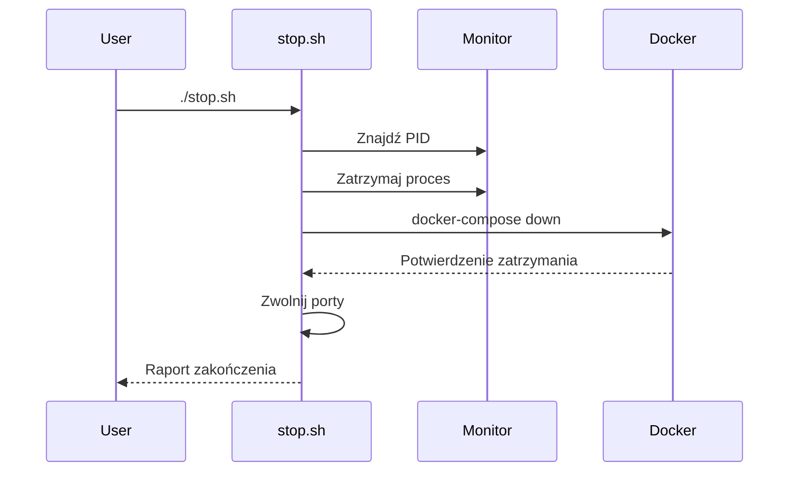

# EvoDev Monitoring System

## Przegląd systemu

System monitorowania EvoDev to niezależny komponent aplikacji, który dostarcza informacje o stanie systemu, kontenerów Docker oraz umożliwia przeglądanie logów w czasie rzeczywistym za pomocą przeglądarki internetowej. System składa się z kilku głównych elementów:

1. **Aplikacja monitorująca (Flask)** - serwer wyświetlający dane w przeglądarce
2. **Skrypty zarządzające** - uruchamianie i zatrzymywanie usług
3. **System logowania** - zbieranie i wyświetlanie logów
4. **Integracja z przeglądarką** - automatyczne otwieranie interfejsu
5. **Integracja z interfejsami webowymi** - podgląd aplikacji webowych w kontenerach
6. **System czatu AI** - wsparcie użytkownika i ewolucja systemu

## Unikalne cechy systemu

System monitorowania EvoDev wyróżnia się na tle innych rozwiązań następującymi cechami:

1. **Jednolity interfejs** - wszystkie widoki dostępne z jednego panelu, bez konieczności przełączania stron
2. **Integracja z kontenerami** - bezpośredni podgląd interfejsów webowych uruchomionych kontenerów
3. **Inteligentne filtrowanie** - pokazywanie tylko istotnych kontenerów i informacji o błędach
4. **Wsparcie AI** - wbudowany system czatu z integracją modeli językowych
5. **Automatyczna ewolucja** - system dostosowuje się do potrzeb użytkownika

## Porównanie z innymi rozwiązaniami

| Funkcja | EvoDev Monitor | Portainer | cAdvisor | Prometheus + Grafana |
|---------|----------------|-----------|----------|---------------------|
| **Interfejs użytkownika** | Jednolity, SPA | Wielostronicowy | Podstawowy | Zaawansowany, złożony |
| **Podgląd kontenerów** | Siatka 4x4 z iframes | Lista z detalami | Tabela statystyk | Wykresy i dashboardy |
| **Integracja z webapps** | Wbudowana (iframe) | Brak | Brak | Częściowa |
| **Wsparcie AI** | Wbudowane | Brak | Brak | Brak |
| **Złożoność konfiguracji** | Minimalna | Średnia | Niska | Wysoka |
| **Przeglądarka logów** | Wbudowana | Podstawowa | Brak | Zaawansowana (Loki) |
| **Automatyczne wykrywanie** | Tak | Częściowe | Tak | Wymaga konfiguracji |
| **Instalacja** | Pojedynczy skrypt | Kontener Docker | Kontener Docker | Wiele komponentów |

## Scenariusze zastosowania

### Scenariusz 1: Sekretarka/Asystent biurowy

**Użytkownik**: Osoba nietechniczna odpowiedzialna za podstawowe monitorowanie systemów biurowych

**Korzyści**:
- Intuicyjny interfejs niewymagający wiedzy technicznej
- Powiadomienia o problemach w prostej formie
- Możliwość szybkiego zgłaszania problemów przez czat AI
- Automatyczne wykrywanie awarii usług

**Przykład użycia**:
> Maria, asystentka w firmie marketingowej, uruchamia EvoDev Monitor rano, aby sprawdzić czy wszystkie systemy działają poprawnie. Zauważa czerwony wskaźnik przy jednym z kontenerów. Zamiast dzwonić do IT, używa czatu AI, który wyjaśnia problem i sugeruje proste rozwiązanie (restart usługi). Maria klika przycisk "Restart" i problem zostaje rozwiązany bez angażowania zespołu IT.

### Scenariusz 2: Programista

**Użytkownik**: Developer pracujący nad złożoną aplikacją z wieloma komponentami

**Korzyści**:
- Szybki podgląd wszystkich usług w jednym miejscu
- Bezpośredni dostęp do interfejsów webowych komponentów
- Szczegółowe logi błędów bez konieczności łączenia się z kontenerami
- Automatyczne wykrywanie konfliktów portów

**Przykład użycia**:
> Tomasz pracuje nad aplikacją składającą się z frontendu, backendu i bazy danych. Używa EvoDev Monitor do śledzenia wszystkich komponentów. Gdy wprowadza zmiany w kodzie, może natychmiast zobaczyć ich efekt w podglądzie iframe, a także sprawdzić logi błędów. System automatycznie informuje go o konfliktach portów i sugeruje rozwiązania, oszczędzając czas na debugowanie.

### Scenariusz 3: Administrator DevOps

**Użytkownik**: Specjalista odpowiedzialny za infrastrukturę i ciągłość działania systemów

**Korzyści**:
- Kompleksowy monitoring zasobów systemowych
- Szczegółowe informacje o kontenerach Docker
- Zaawansowana analiza logów z wielu źródeł
- Możliwość automatyzacji reakcji na problemy

**Przykład użycia**:
> Anna zarządza infrastrukturą firmy e-commerce. EvoDev Monitor pozwala jej śledzić obciążenie systemu podczas promocji sprzedażowych. Gdy system wykrywa zwiększone użycie zasobów, automatycznie skaluje usługi. Anna może przeglądać logi z wielu źródeł w jednym interfejsie, co pozwala szybko identyfikować wąskie gardła. Dzięki integracji z AI, system uczy się wzorców obciążenia i proaktywnie sugeruje optymalizacje.

## Architektura systemu

### Schemat blokowy

```
┌──────────────────────────────────────────────────────────┐
│                     run.sh                               │
│  ┌─────────────────┐     ┌──────────────┐                │
│  │ start_monitor() │────▶│ open_browser │                │
│  └─────────────────┘     └──────────────┘                │
│          │                                               │
│          ▼                                               │
│  ┌─────────────────┐     ┌──────────────┐                │
│  │ Docker Compose  │────▶│  Kontenery   │                │
│  └─────────────────┘     └──────────────┘                │
└──────────────────────────────────────────────────────────┘

┌──────────────────────────────────────────────────────────┐
│                     monitor/app.py                       │
│  ┌─────────────────┐     ┌──────────────┐                │
│  │    Flask App    │────▶│  Web UI (/)  │                │
│  └─────────────────┘     └──────────────┘                │
│          │                      │                        │
│          │                      ▼                        │
│          │              ┌──────────────┐                 │
│          │              │ Widok logów  │                 │
│          │              │   (/logs)    │                 │
│          │              └──────────────┘                 │
│          │                                               │
│          ▼                                               │
│  ┌─────────────────┐     ┌──────────────┐                │
│  │  API Endpoints  │────▶│ monitoring_  │                │
│  │  (/api/*)       │     │   thread()   │                │
│  └─────────────────┘     └──────────────┘                │
│                                 │                        │
│                                 ▼                        │
│                          ┌──────────────┐                │
│                          │  SQLite DB   │                │
│                          └──────────────┘                │
└──────────────────────────────────────────────────────────┘

┌──────────────────────────────────────────────────────────┐
│                     stop.sh                              │
│  ┌─────────────────┐     ┌──────────────┐                │
│  │  Zatrzymanie    │────▶│  Zwolnienie  │                │
│  │    procesów     │     │    portów    │                │
│  └─────────────────┘     └──────────────┘                │
└──────────────────────────────────────────────────────────┘
```

### Przepływ danych

```
┌──────────────────┐     ┌──────────────┐     ┌──────────────┐
│    Aplikacja     │     │   Monitor    │     │  Przeglądarka │
│     EvoDev       │────▶│   (Flask)    │────▶│   (Browser)   │
└──────────────────┘     └──────────────┘     └──────────────┘
         │                      │                     │
         │                      │                     │
         ▼                      ▼                     ▼
┌──────────────────┐     ┌──────────────┐     ┌──────────────┐
│     Docker       │     │   SQLite DB  │     │   API Calls  │
│   Containers     │────▶│ (Status Data)│◀────│   (AJAX)     │
└──────────────────┘     └──────────────┘     └──────────────┘
```

## Komponenty systemu

### 1. Struktura katalogów

```
/evodev/
├── monitor/                   # Główny katalog aplikacji monitorującej
│   ├── app.py                 # Serwer Flask
│   ├── requirements.txt       # Zależności Pythona
│   ├── templates/             # Szablony HTML
│   │   ├── index.html         # Dashboard główny
│   │   └── logs.html          # Przeglądarka logów
│   └── static/                # Pliki statyczne
│       └── style.css          # Style CSS
├── run.sh                     # Skrypt uruchamiający
├── stop.sh                    # Skrypt zatrzymujący
├── .env                       # Zmienne środowiskowe
└── monitor.log                # Plik logu monitora
```

### 2. Aplikacja monitorująca (app.py)

Aplikacja monitorująca zbudowana jest na bazie Flask i odpowiada za:

- Zbieranie danych o systemie (CPU, pamięć, dysk)
- Sprawdzanie statusu kontenerów Docker
- Udostępnianie interfejsu webowego
- Logowanie zdarzeń
- Wyświetlanie logów aplikacji

### 3. Skrypt uruchamiający (run.sh)

Skrypt `run.sh` zawiera zaawansowaną logikę uruchamiania monitora:

- Automatyczne wykrywanie działających instancji monitora
- Zarządzanie konfliktami portów
- Automatyczne otwieranie interfejsu w przeglądarce
- Uruchamianie pozostałych usług Docker

### 4. Skrypt zatrzymujący (stop.sh)

Skrypt `stop.sh` odpowiedzialny za czyszczenie systemu:

- Zatrzymywanie wszystkich procesów
- Zwalnianie używanych portów
- Usuwanie tymczasowych plików

### 5. Zmienne środowiskowe (.env)

Plik `.env` przechowuje centralne konfiguracje portów i hostów używanych przez wszystkie komponenty.

## Ekrany interfejsu

### Dashboard główny

*[Dashboard główny - zrzut ekranu]*

Dashboard główny pokazuje:
- Statystyki użycia CPU (wykres procentowy)
- Statystyki użycia pamięci (wykres procentowy)
- Statystyki użycia dysku (wykres procentowy)
- Status kontenerów Docker (lista z kolorowym oznaczeniem stanu)
- Ostatnie 10 zdarzeń systemowych (tabelka z datą i komunikatem)

### Przeglądarka logów

*[Przeglądarka logów - zrzut ekranu]*

Przeglądarka logów oferuje:
- Wybór pliku logu z dostępnych w systemie (lista rozwijana)
- Filtrowanie logów według poziomu (error, warning, info, debug)
- Automatyczne odświeżanie (przełącznik)
- Kolorowe oznaczenie różnych poziomów logowania
- Możliwość pobrania pliku logu
- Przełączanie między widokiem formatowanym a surowym

## Przepływ pracy

### 1. Uruchomienie systemu



### 2. Przeglądanie logów



### 3. Zatrzymanie systemu



## Jak korzystać z systemu

### Uruchomienie monitora

```bash
./run.sh
```

### Wyświetlanie logów

```bash
./run.sh --logs
```
lub otwarcie przeglądarki pod adresem http://localhost:8080/logs

### Zatrzymanie całego systemu

```bash
./stop.sh
```

## Rozwiązywanie problemów

### Konflikt portów

System automatycznie wykrywa i obsługuje konflikty portów. Jeśli port 8080 jest zajęty:
1. Aplikacja spróbuje zatrzymać proces używający tego portu
2. Alternatywnie możesz zmienić port w pliku `.env` ustawiając inną wartość MONITOR_PORT

### Monitorowanie nie działa

Sprawdź plik `monitor.log` w katalogu głównym, aby zobaczyć błędy. Najczęstsze problemy:
- Brak wymaganych zależności - uruchom `pip install -r monitor/requirements.txt`
- Port już używany - uruchom `./stop.sh` aby zwolnić porty
- Nieaktualne pliki PID - usuń plik `monitor.pid` jeśli istnieje

## Rozszerzenie systemu

Monitoring może być rozbudowany o dodatkowe funkcje:
- Powiadomienia email/SMS o problemach
- Integracja z zewnętrznymi systemami monitoringu (Nagios, Grafana)
- Dodatkowe metryki specyficzne dla aplikacji
- Automatyczne restarty usług w przypadku awarii
