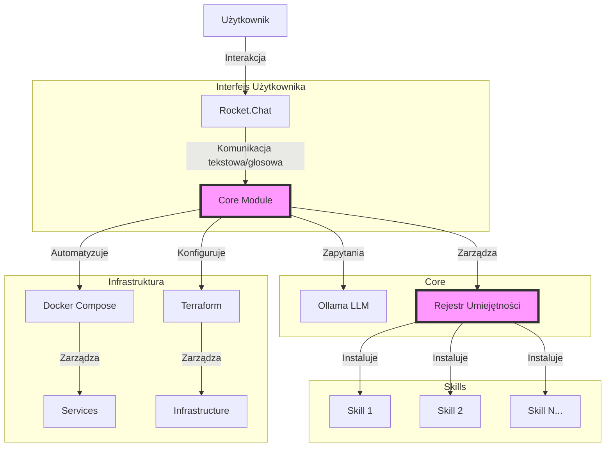
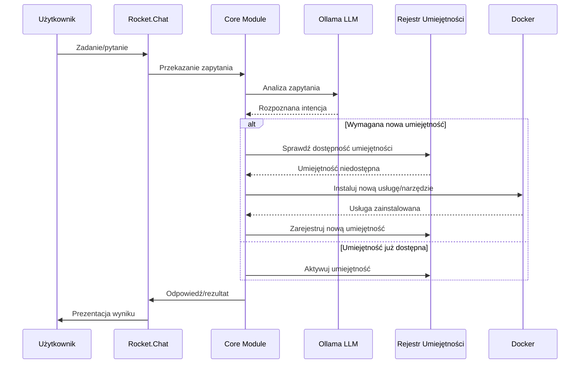
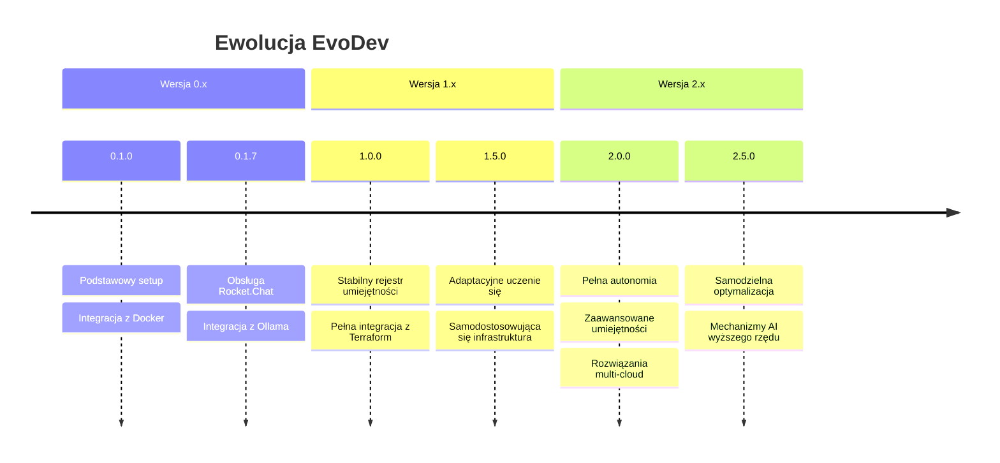

# EvoDev - Asystent ewolucyjny dla programistów

## Co to jest EvoDev?

EvoDev to innowacyjny asystent ewolucyjny dla programistów, który automatycznie dostosowuje się do środowiska i rozwija swoje umiejętności poprzez dynamiczną instalację i konfigurację nowych narzędzi i usług. Wykorzystuje lokalnie hostowane modele LLM do komunikacji z użytkownikiem, zapewniając pełną prywatność danych.

## Jak działa EvoDev?

### Architektura (diagram Mermaid)


### Przepływ pracy (diagram Mermaid)


## Przykłady użycia

### Przykład 1: Dodanie nowej umiejętności

1. **Użytkownik**: "Potrzebuję narzędzia do analizy wydajności kodu JavaScript"
2. **EvoDev**:
   - Rozpoznaje intencję poprzez Ollama LLM
   - Identyfikuje brak odpowiedniej umiejętności
   - Automatycznie instaluje narzędzia do profilowania JS (np. Lighthouse)
   - Konfiguruje Docker container
   - Udostępnia umiejętność przez interfejs Rocket.Chat

### Przykład 2: Automatyczne dostosowanie środowiska

1. **Użytkownik**: "Rozpoczynam projekt w Django, przygotuj środowisko"
2. **EvoDev**:
   - Instaluje wymagane kontenery (Python, PostgreSQL)
   - Konfiguruje strukturę projektu
   - Ustawia narzędzia testowe i CI/CD
   - Udostępnia zintegrowane środowisko

## Komponenty technologiczne

- **Frontend**: Rocket.Chat (interfejs tekstowy i głosowy)
- **Backend**: 
  - Ollama (lokalny LLM)
  - Terraform (infrastruktura)
  - Docker Compose (usługi)
- **Umiejętności**:
  - Narzędzia programistyczne
  - Środowiska deweloperskie
  - Usługi analityczne
  - Automatyzacja zadań

## Instalacja i uruchomienie

```bash
# Klonowanie repozytorium
git clone https://github.com/username/evodev.git
cd evodev

# Uruchomienie
./run.sh
```

Skrypt `run.sh` automatycznie:
1. Instaluje wymagane zależności (Docker, Terraform, Ansible)
2. Konfiguruje infrastrukturę i kontenery
3. Uruchamia interfejs użytkownika
4. Udostępnia adres URL do komunikacji z asystentem

## Cykl życia EvoDev

```mermaid
graph LR
    Start[Uruchomienie] --> Init[Inicjalizacja]
    Init --> CheckDeps[Sprawdzenie zależności]
    CheckDeps --> InstallDeps[Instalacja brakujących]
    InstallDeps --> ConfigServices[Konfiguracja usług]
    ConfigServices --> StartServices[Uruchomienie usług]
    StartServices --> Connect[Połączenie z interfejsem]
    Connect --> Learn[Nauka i adaptacja]
    
    Learn --> |Nowy problem| Identify[Identyfikacja potrzeb]
    Identify --> |Brak umiejętności| Acquire[Pozyskanie umiejętności]
    Acquire --> Store[Zapis w rejestrze]
    Store --> Use[Wykorzystanie umiejętności]
    
    Learn --> |Znany problem| Use
    Use --> |Wynik| Present[Prezentacja rezultatu]
    
    Present --> Learn
    
    class Start,Learn highlight
    classDef highlight fill:#f9f,stroke:#333,stroke-width:4px
```



## Szczegółowa architektura systemów

### Struktura katalogów EvoDev

```
evodev/
├── core/
│   ├── llm_manager.py      # Zarządzanie modelami LLM
│   ├── skill_registry.py   # Rejestr umiejętności
│   └── event_handler.py    # Obsługa zdarzeń
├── services/
│   ├── docker-compose.yml  # Definicje kontenerów
│   ├── terraform/          # Pliki konfiguracyjne Terraform
│   └── ansible/            # Playbooki Ansible
├── skills/
│   ├── web_dev/            # Umiejętności do web dev
│   ├── data_analysis/      # Umiejętności do analizy danych
│   └── devops/             # Umiejętności DevOps
├── interfaces/
│   └── rocketchat/         # Integracja z Rocket.Chat
├── run.sh                  # Główny skrypt uruchomieniowy
└── README.md               # Dokumentacja podstawowa
```

## Rozwój EvoDev w czasie


