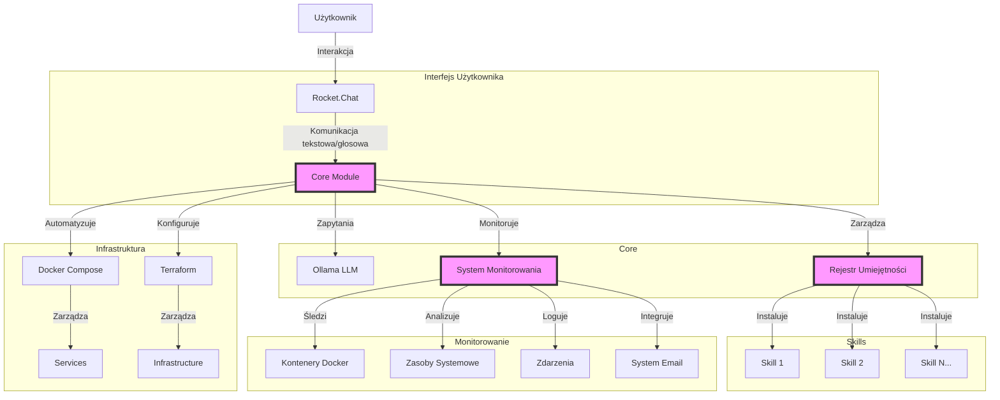
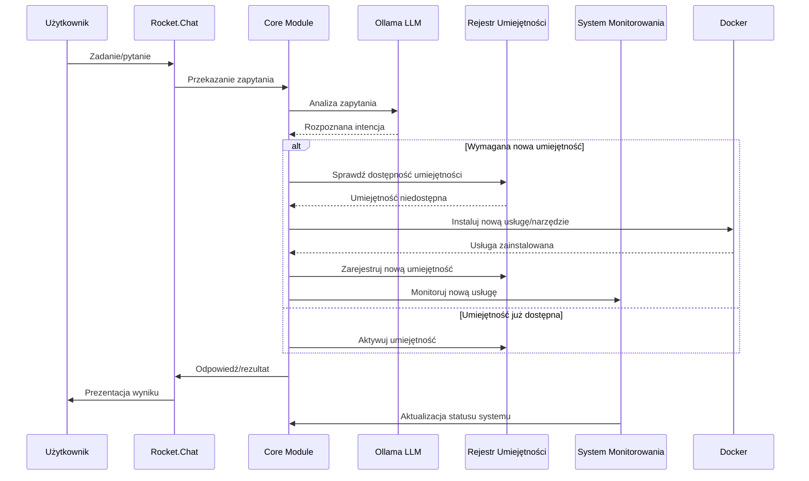
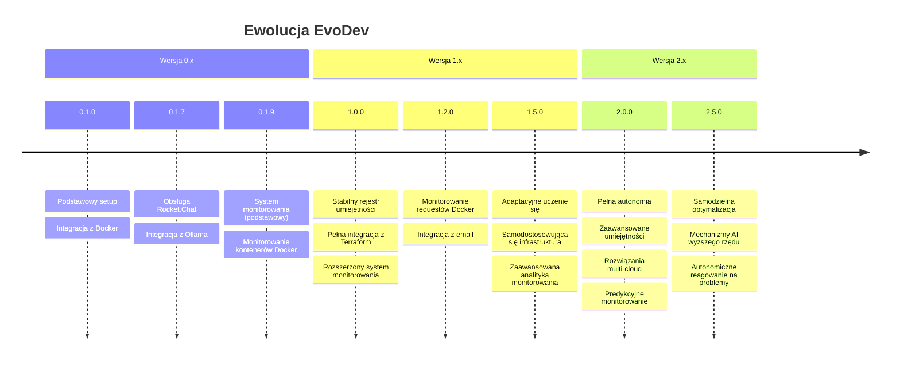

# EvoDev - Asystent ewolucyjny dla programistów

## Co to jest EvoDev?

EvoDev to innowacyjny asystent ewolucyjny dla programistów, który automatycznie dostosowuje się do środowiska i rozwija swoje umiejętności poprzez dynamiczną instalację i konfigurację nowych narzędzi i usług. Wykorzystuje lokalnie hostowane modele LLM do komunikacji z użytkownikiem, zapewniając pełną prywatność danych.

## Jak działa EvoDev?

### Architektura (diagram Mermaid)


### Przepływ pracy (diagram Mermaid)


## Przykłady użycia

### Przykład 1: Dodanie nowej umiejętności

1. **Użytkownik**: "Potrzebuję narzędzia do analizy wydajności kodu JavaScript"
2. **EvoDev**:
   - Rozpoznaje intencję poprzez Ollama LLM
   - Identyfikuje brak odpowiedniej umiejętności
   - Automatycznie instaluje narzędzia do profilowania JS (np. Lighthouse)
   - Konfiguruje Docker container
   - Udostępnia umiejętność przez interfejs Rocket.Chat
   - Monitoruje działanie nowego kontenera

### Przykład 2: Automatyczne dostosowanie środowiska

1. **Użytkownik**: "Rozpoczynam projekt w Django, przygotuj środowisko"
2. **EvoDev**:
   - Instaluje wymagane kontenery (Python, PostgreSQL)
   - Konfiguruje strukturę projektu
   - Ustawia narzędzia testowe i CI/CD
   - Udostępnia zintegrowane środowisko
   - Monitoruje zasoby i wydajność środowiska

### Przykład 3: Monitorowanie i powiadomienia

1. **Użytkownik**: "Powiadom mnie, gdy zużycie CPU przekroczy 80%"
2. **EvoDev**:
   - Konfiguruje alert w systemie monitorowania
   - Ustawia kanał powiadomień (email, chat)
   - Monitoruje zużycie CPU
   - Wysyła powiadomienie, gdy warunek zostanie spełniony

## Komponenty technologiczne

- **Frontend**: 
  - Rocket.Chat (interfejs tekstowy i głosowy)
  - System monitorowania (Flask, SQLite)
- **Backend**: 
  - Ollama (lokalny LLM)
  - Terraform (infrastruktura)
  - Docker Compose (usługi)
  - System monitorowania requestów Docker
  - System email (SMTP/IMAP)
- **Umiejętności**:
  - Narzędzia programistyczne
  - Środowiska deweloperskie
  - Usługi analityczne
  - Automatyzacja zadań

## Instalacja i uruchomienie

```bash
# Klonowanie repozytorium
git clone https://github.com/username/evodev.git
cd evodev

# Uruchomienie
./run.sh
```

Skrypt `run.sh` automatycznie:
1. Instaluje wymagane zależności (Docker, Terraform, Ansible)
2. Konfiguruje infrastrukturę i kontenery
3. Uruchamia interfejs użytkownika i system monitorowania
4. Udostępnia adres URL do komunikacji z asystentem
5. Otwiera interfejs monitora w przeglądarce

## System monitorowania

System monitorowania EvoDev to zaawansowany komponent, który zapewnia:

- **Monitorowanie kontenerów Docker** - status, logi, statystyki
- **Śledzenie zasobów systemowych** - CPU, pamięć, dysk
- **Analiza ruchu sieciowego** - monitorowanie requestów między kontenerami
- **Powiadomienia email** - alerty i raporty
- **Interfejs czatu AI** - interakcja z systemem przez LLM

### Interfejs monitora

Interfejs monitora jest dostępny pod adresem: `http://localhost:8080`

Główne widoki:
- **Dashboard** - ogólny przegląd systemu
- **Logi** - przeglądarka logów systemowych
- **Docker** - szczegółowe informacje o kontenerach
- **Requesty** - analiza ruchu sieciowego między kontenerami
- **Czat AI** - interakcja z systemem przez LLM

### Integracja z email

System monitorowania zawiera wbudowaną integrację z email, która umożliwia:
- Wysyłanie powiadomień o zdarzeniach systemowych
- Konfigurację serwera SMTP/IMAP
- Odbieranie i przetwarzanie poleceń przez email
- Automatyczne raportowanie statusu systemu

## Cykl życia EvoDev

```mermaid
graph LR
    Start[Uruchomienie] --> Init[Inicjalizacja]
    Init --> CheckDeps[Sprawdzenie zależności]
    CheckDeps --> InstallDeps[Instalacja brakujących]
    InstallDeps --> ConfigServices[Konfiguracja usług]
    ConfigServices --> StartMonitor[Uruchomienie monitora]
    StartMonitor --> StartServices[Uruchomienie usług]
    StartServices --> Connect[Połączenie z interfejsem]
    Connect --> Learn[Nauka i adaptacja]
    
    Learn --> |Nowy problem| Identify[Identyfikacja potrzeb]
    Identify --> |Brak umiejętności| Acquire[Pozyskanie umiejętności]
    Acquire --> Store[Zapis w rejestrze]
    Store --> Monitor[Monitorowanie usługi]
    Monitor --> Use[Wykorzystanie umiejętności]
    
    Learn --> |Znany problem| Use
    Use --> |Wynik| Present[Prezentacja rezultatu]
    
    Present --> Learn
    
    class Start,Learn,Monitor highlight
    classDef highlight fill:#f9f,stroke:#333,stroke-width:4px
```



## Szczegółowa architektura systemów

### Struktura katalogów EvoDev

```
evodev/
├── core/
│   ├── llm_manager.py      # Zarządzanie modelami LLM
│   ├── skill_registry.py   # Rejestr umiejętności
│   └── event_handler.py    # Obsługa zdarzeń
├── monitor/                # System monitorowania
│   ├── app.py              # Aplikacja Flask
│   ├── docker_monitor.py   # Monitorowanie requestów Docker
│   ├── email_utils.py      # Integracja z email
│   ├── requirements.txt    # Zależności Pythona
│   ├── static/             # Pliki statyczne (CSS, JS)
│   └── templates/          # Szablony HTML
├── services/
│   ├── docker-compose.yml  # Definicje kontenerów
│   ├── terraform/          # Pliki konfiguracyjne Terraform
│   └── ansible/            # Playbooki Ansible
├── skills/
│   ├── web_dev/            # Umiejętności do web dev
│   ├── data_analysis/      # Umiejętności do analizy danych
│   └── devops/             # Umiejętności DevOps
├── interfaces/
│   └── rocketchat/         # Integracja z Rocket.Chat
├── run.sh                  # Główny skrypt uruchomieniowy
├── stop.sh                 # Skrypt zatrzymujący system
└── README.md               # Dokumentacja podstawowa
```

### Komponenty systemu monitorowania

1. **app.py** - Główna aplikacja Flask, która:
   - Udostępnia interfejs webowy
   - Monitoruje zasoby systemowe (CPU, pamięć, dysk)
   - Śledzi status kontenerów Docker
   - Zarządza bazą danych SQLite
   - Obsługuje czat AI z integracją LLM

2. **docker_monitor.py** - Moduł monitorowania requestów Docker:
   - Śledzi komunikację między kontenerami
   - Analizuje ruch sieciowy (HTTP/HTTPS)
   - Zapisuje statystyki do bazy danych
   - Generuje raporty wydajności

3. **email_utils.py** - Moduł integracji z email:
   - Konfiguracja serwerów SMTP/IMAP
   - Wysyłanie powiadomień i alertów
   - Odbieranie i przetwarzanie poleceń
   - Opcjonalna konfiguracja lokalnego serwera email (Docker)

### Integracja z modelami LLM

System monitorowania zawiera integrację z różnymi dostawcami modeli LLM:

- **OpenAI** - integracja z API OpenAI (GPT-3.5, GPT-4)
- **Anthropic** - integracja z API Anthropic (Claude)
- **Ollama** - integracja z lokalnymi modelami LLM
- **MCP** (Model Context Protocol) - rozszerzony protokół komunikacji z modelami

## Rozwój EvoDev w czasie



## Zależności systemu

System monitorowania wymaga następujących zależności Python:

```
flask==2.0.1
psutil==5.9.0
docker==6.1.0
requests==2.31.0
secure-smtplib
imapclient
email-validator
```

## Integracja z innymi systemami

EvoDev można zintegrować z:

1. **Systemy CI/CD** - automatyczne wdrażanie zmian
2. **Platformy chmurowe** - AWS, GCP, Azure
3. **Systemy monitorowania** - Prometheus, Grafana
4. **Narzędzia komunikacyjne** - Slack, Discord, MS Teams
5. **Systemy ticketowe** - JIRA, ServiceNow

## Rozszerzanie systemu

Aby rozszerzyć funkcjonalność EvoDev:

1. **Dodawanie nowych umiejętności**:
   - Utwórz nowy katalog w `skills/`
   - Dodaj definicję kontenera Docker
   - Zarejestruj umiejętność w rejestrze

2. **Rozszerzanie monitora**:
   - Dodaj nowe endpointy API w `app.py`
   - Utwórz nowe szablony w `templates/`
   - Rozszerz bazę danych o nowe tabele

3. **Integracja z nowymi modelami LLM**:
   - Dodaj nową funkcję w `app.py` dla obsługi API modelu
   - Skonfiguruj zmienne środowiskowe dla kluczy API
   - Dostosuj format zapytań i odpowiedzi
