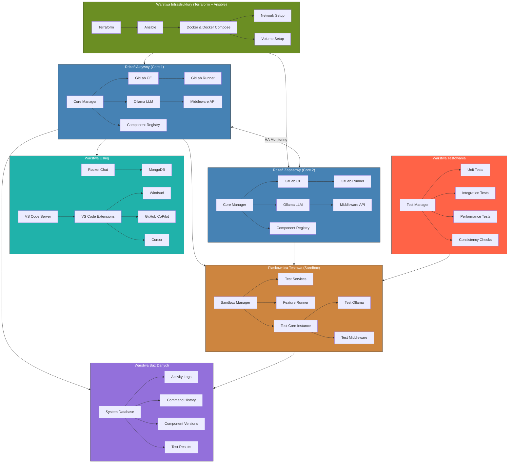

system powinien mieć dwa rdzenie, na wypadek, gdyby jeden z nich przestał działac to w podstawowej wartswie architektury konfigurowanej z terraform i ansible beda zdefiniowane dwie instancje, ktore beda identyczne i beda w przyadku awarii jedenj z nich replikowalne. ale w danym momnencie nma dzialac tylko jedna.
System core ma umiec testowac nowe feature i tworzyc bufixing w ramach gitlab-ci oraz udostepniac te nowe funkcje w ramach dwoch core, jeden moze być testowy a drugi do uzycia , gdy testowy bedzie dziala, ollama powinen sam sie przetstowac, tzn moc tetsowac swojego blizniaka, po uruchomieniu nowej funkcjonalnosc w docker compose lub po zmianach, aktualizacjiach, itd. wszystko powinno byc transaparentne, kazda, zmiana, proces, komenda w shell, request powinna byc rejestrowana w bazie danych by moc latwo z poziomu ollama zpaytac o logi poprzez text2sql, wydziel kazda umioejetnosc tak by ollama potrafila je potem aktualizowac oddzielnie i testowac swojego blizniaka, aby wszystko dzialal bez problemow. blizniak powinien dzialac w sandbox, aby nie naruszyl podstaowego core z dwoma tymi samymi instancjami

