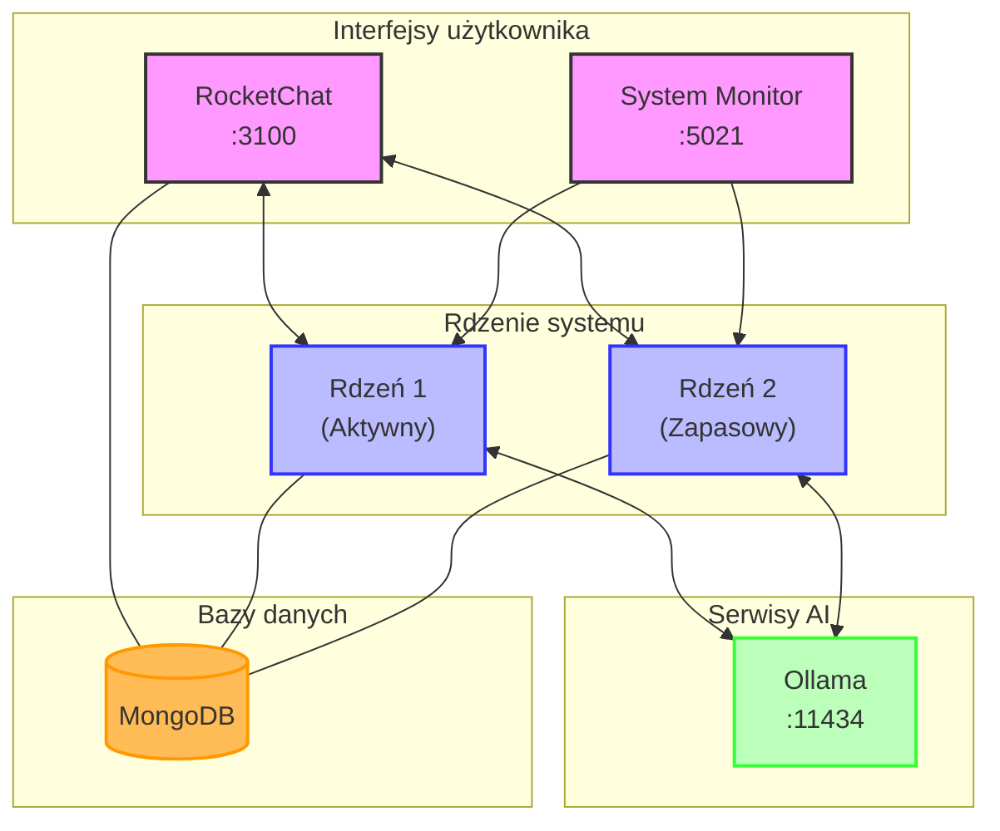
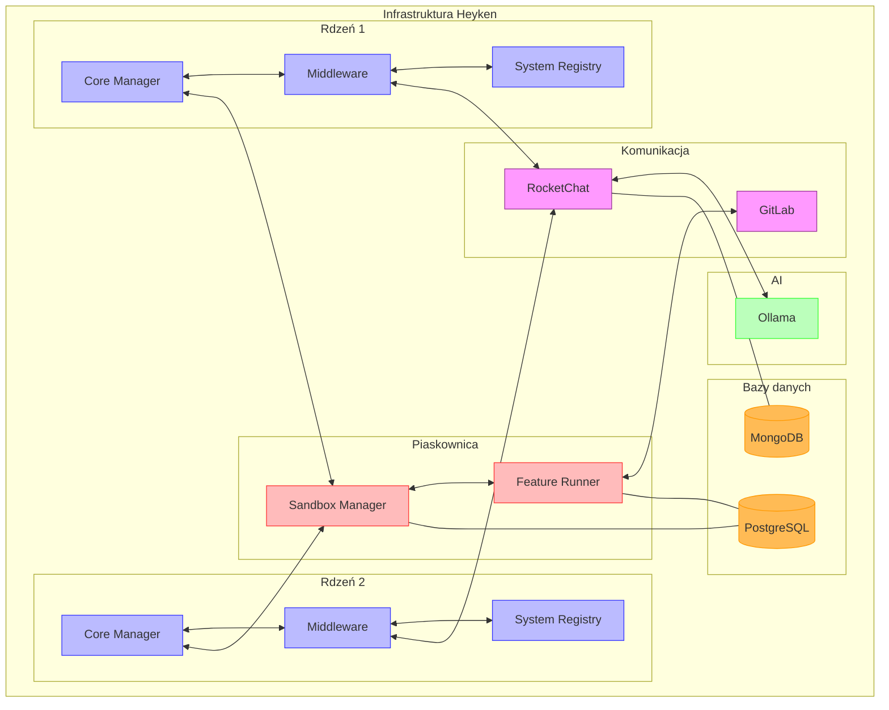
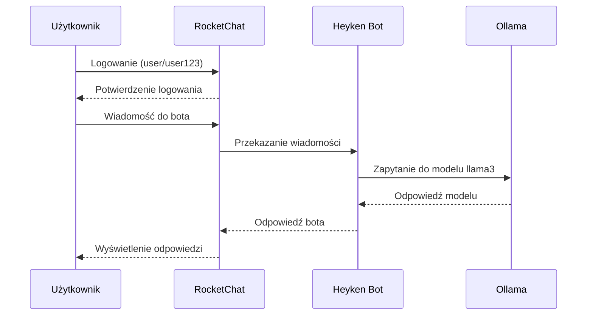
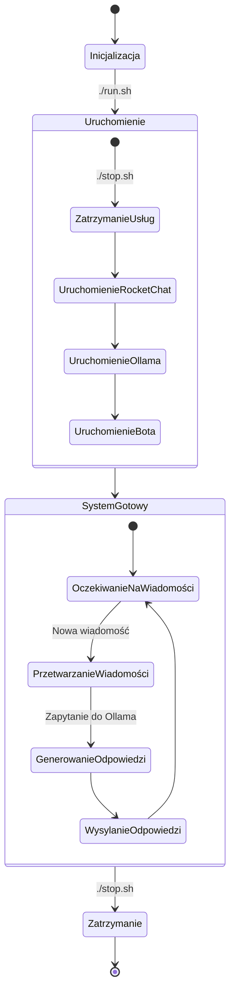

# Heyken

## System autonomicznego programowania z redundantnymi rdzeniami

**[heyken.io](https://heyken.io) | [hey-ken.com](https://hey-ken.com)**

Heyken to kompleksowy system autonomicznego programowania zaprojektowany z myślą o niezawodności i samorozwoju. 
System wykorzystuje architekturę dwóch redundantnych rdzeni, które zapewniają ciągłość działania nawet w przypadku awarii jednego z nich.



## Kluczowe funkcjonalności

1. **Redundantne rdzenie** - system działa na dwóch identycznych rdzeniach, z których jeden jest aktywny, a drugi w trybie gotowości
2. **Piaskownica testowa** - izolowane środowisko do bezpiecznego testowania nowych funkcjonalności
3. **Automatyzacja CI/CD** - zintegrowana z GitLab automatyzacja procesu testowania i wdrażania
4. **Samorozwój** - zdolność do samodzielnego tworzenia i testowania nowych funkcjonalności
5. **Dynamiczna infrastruktura** - możliwość dodawania nowych usług Docker według potrzeb
6. **Kompleksowe logowanie** - szczegółowe rejestrowanie wszystkich działań systemu

## Architektura

### Warstwy systemu
- **Rdzeń 1 i Rdzeń 2** - redundantne jednostki zarządzające całym systemem
- **Piaskownica (Sandbox)** - izolowane środowisko do testowania nowych funkcji
- **Baza danych** - centralne repozytorium przechowujące logi i konfiguracje
- **Usługi Docker** - dynamicznie dodawane kontenery z nowymi funkcjonalnościami



### Mechanizmy bezpieczeństwa
- Izolacja warstw poprzez dedykowane sieci Docker
- Testowanie wszystkich nowych funkcji w piaskownicy przed wdrożeniem
- Ograniczone użycie zewnętrznych API tylko do procesu nauki

## Wymagania systemowe

- Docker i Docker Compose
- Python 3.8 lub nowszy
- Terraform 1.0 lub nowszy
- Ansible 2.9 lub nowszy
- Minimum 8GB RAM i 20GB wolnego miejsca na dysku
- Dostęp do internetu podczas inicjalizacji

## Szczegółowa instrukcja uruchomienia

### Zalecana sekwencja uruchamiania

Na podstawie doświadczeń z wdrażaniem systemu, zalecamy następującą sekwencję uruchamiania, która minimalizuje problemy z zależnościami między usługami:

```bash
# 1. Uruchom najpierw RocketChat (interfejs komunikacyjny)
./run_heyken.sh

# LUB użyj skryptu, który uruchamia RocketChat z MongoDB 5.0
cd docker/rocketchat
docker-compose -f docker-compose-new.yml up -d
cd ../..

# 2. Poczekaj aż RocketChat będzie dostępny (http://localhost:3100)
# Następnie kontynuuj wdrażanie reszty infrastruktury
./continue_heyken_deployment.sh
```

### Standardowe skrypty systemowe

```bash
# Inicjalizacja systemu (tworzy strukturę katalogów i pliki konfiguracyjne)
./scripts/init.sh

# Wdrożenie infrastruktury (uruchamia wszystkie kontenery Docker)
./scripts/deploy.sh

# Sprawdzanie statusu wszystkich komponentów
./scripts/status.sh

# Przełączanie między rdzeniami (1 lub 2)
./scripts/switch_core.sh [1|2]

# Zatrzymanie wszystkich usług
./stop.sh
```

## Dostępne interfejsy i usługi

Po uruchomieniu systemu, dostępne są następujące interfejsy:

- **RocketChat**: http://localhost:3100 - interfejs komunikacyjny
- **GitLab**: http://localhost:8080 - repozytorium kodu i CI/CD
- **Sandbox Manager**: http://localhost:5010 - zarządzanie środowiskiem testowym
- **System Monitor**: http://localhost:5021 - monitorowanie stanu systemu
- **Logger API**: http://localhost:5020 - dostęp do logów systemowych
- **Component Registry**: http://localhost:5002 - rejestr komponentów
- **Ollama API**: http://localhost:11434 - API dla modeli LLM

## Konfiguracja RocketChat

System Heyken wykorzystuje RocketChat jako główny interfejs komunikacyjny. Podczas uruchamiania systemu, RocketChat jest automatycznie konfigurowany z następującymi użytkownikami i kanałami:

### Użytkownicy

- **Administrator**: admin / dxIsDLnhiqKfDt5J
- **Bot Heyken**: heyken_bot / heyken123
- **Użytkownik**: user / user123

Wszystkie powyższe dane logowania są skonfigurowane w pliku `.env` i można je tam zmienić przed pierwszym uruchomieniem systemu.



### Kanały

- **general**: Ogólny kanał komunikacyjny
- **heyken-system**: Kanał z informacjami o statusie systemu
- **heyken-logs**: Kanał zawierający logi systemowe
- **heyken-sandbox**: Prywatny kanał do testowania nowych funkcjonalności

### Automatyczna konfiguracja

Podczas uruchamiania systemu za pomocą skryptu `run_heyken.sh`, RocketChat jest automatycznie konfigurowany przy użyciu jednego z dostępnych skryptów konfiguracyjnych. System próbuje użyć skryptów w następującej kolejności:

1. `scripts/setup_rocketchat_simple.sh` (zalecany) - używa niestandardowego obrazu Docker z prekonfigurowanymi ustawieniami
2. `scripts/setup_rocketchat_complete.sh` - bardziej zaawansowana konfiguracja z dodatkowymi opcjami
3. `scripts/setup_rocketchat.sh` - podstawowy skrypt konfiguracyjny

Każdy z tych skryptów wykonuje następujące operacje:

1. Przeprowadza inicjalną konfigurację RocketChat (pomija kreator konfiguracji)
2. Tworzy konto administratora
3. Tworzy konta dla bota Heyken i użytkownika
4. Tworzy kanały komunikacyjne (heyken-system, heyken-logs, heyken-sandbox)
5. Dodaje użytkowników do odpowiednich kanałów

### Ręczna konfiguracja

Jeśli chcesz ręcznie skonfigurować RocketChat:

```bash
# Uruchom RocketChat z MongoDB 5.0
cd docker/rocketchat
docker-compose -f docker-compose-simple.yml up -d
cd ../..

# Poczekaj aż RocketChat będzie dostępny (http://localhost:3100)
# Następnie uruchom skrypt konfiguracyjny
cd scripts
./setup_rocketchat_simple.sh
```

Możesz również skonfigurować RocketChat ręcznie przez interfejs webowy, przechodząc przez kreator konfiguracji pod adresem http://localhost:3100/setup-wizard/1. Po zakończeniu kreatora, zaloguj się jako administrator i utwórz wymaganych użytkowników i kanały.

## Rozwiązywanie typowych problemów

### Problem z MongoDB w RocketChat

RocketChat 7.5.1 wymaga MongoDB 5.0 lub nowszej. Jeśli napotkasz błąd:

```
YOUR CURRENT MONGODB VERSION IS NOT SUPPORTED BY ROCKET.CHAT, PLEASE UPGRADE TO VERSION 5.0 OR LATER
```

Rozwiązanie:
1. Zatrzymaj kontenery RocketChat: `cd docker/rocketchat && docker-compose down`
2. Użyj konfiguracji z MongoDB 5.0: `docker-compose -f docker-compose-new.yml up -d`

### Problem z restartem kontenerów

Jeśli kontenery ciągle się restartują (widoczne w `docker ps` jako "Restarting"):

1. Sprawdź logi kontenera: `docker logs <nazwa_kontenera>`
2. Najczęstsze przyczyny to problemy z połączeniem do bazy danych lub innych zależnych usług
3. Upewnij się, że wszystkie zależne usługi są uruchomione przed startem kontenera

### Problem z GitLab

GitLab może potrzebować kilku minut na pełną inicjalizację. Jeśli widzisz błędy konfiguracji:

1. Sprawdź logi: `docker logs gitlab_core1`
2. Poczekaj 5-10 minut na pełną inicjalizację
3. Jeśli problem z hostnamen: `docker exec -it gitlab_core1 editor /etc/gitlab/gitlab.rb`

## Przykłady użycia

### Przykład 1: Tworzenie nowej funkcjonalności

```bash
# 1. Utwórz nową funkcjonalność w piaskownicy
curl -X POST http://localhost:5010/api/features/create \
  -H "Content-Type: application/json" \
  -d '{"name":"nowa_funkcja","description":"Opis nowej funkcji"}'

# 2. Uruchom testy w piaskownicy
curl -X POST http://localhost:5010/api/features/test \
  -H "Content-Type: application/json" \
  -d '{"feature_id":"123"}'

# 3. Wdróż funkcjonalność do aktywnego rdzenia
curl -X POST http://localhost:5010/api/features/deploy \
  -H "Content-Type: application/json" \
  -d '{"feature_id":"123","target_core":1}'
```



### Przykład 2: Monitorowanie stanu systemu

```bash
# Pobierz aktualny status wszystkich komponentów
curl http://localhost:5021/api/status

# Pobierz ostatnie logi systemowe
curl http://localhost:5020/api/logs?limit=10

# Sprawdź dostępne komponenty
curl http://localhost:5002/api/components
```

### Przykład 3: Komunikacja przez RocketChat

1. Otwórz przeglądarkę i przejdź do http://localhost:3100
2. Zaloguj się jako użytkownik (domyślnie: user/user123)
3. Przejdź do kanału "heyken-system" aby monitorować status systemu
4. Użyj kanału "heyken-logs" do przeglądania logów systemowych
5. Kanał "heyken-sandbox" służy do testowania nowych funkcjonalności

## Funkcje dodatkowe

- **text2sql** - interfejs do analizy logów przez zapytania w języku naturalnym
- **FeatureRunner** - mechanizm do testowania i wdrażania nowych funkcjonalności
- **Monitorowanie stanu** - ciągła obserwacja wszystkich komponentów systemu

## Integracja RocketChat z Ollama

Poniższy diagram przedstawia szczegółowy przepływ danych między RocketChat a Ollama za pośrednictwem bota Heyken:

```mermaid
flowchart LR
    subgraph "Komunikacja"
        U[Użytkownik]:::userNode
        RC[RocketChat\n:3100]:::rcNode
    end
    
    subgraph "Bot Heyken"
        BM[Bot Manager]:::botNode
        OC[Ollama Client]:::botNode
    end
    
    subgraph "Ollama"
        OA[Ollama API\n:11434]:::ollamaNode
        LM[Model llama3]:::ollamaNode
    end
    
    U -->|"1. Wysłanie wiadomości"| RC
    RC -->|"2. Webhook / API"| BM
    BM -->|"3. Zapytanie"| OC
    OC -->|"4. Generowanie tekstu"| OA
    OA -->|"5. Przetwarzanie"| LM
    LM -->|"6. Odpowiedź modelu"| OA
    OA -->|"7. Strumień tekstu"| OC
    OC -->|"8. Sformatowana odpowiedź"| BM
    BM -->|"9. Odpowiedź bota"| RC
    RC -->|"10. Wyświetlenie odpowiedzi"| U
    
    classDef userNode fill:#f96,stroke:#f63,stroke-width:2px
    classDef rcNode fill:#f9f,stroke:#939,stroke-width:2px
    classDef botNode fill:#bbf,stroke:#33f,stroke-width:2px
    classDef ollamaNode fill:#bfb,stroke:#3f3,stroke-width:2px
```



---

&copy; 2025 Heyken - System autonomicznego programowania z redundantnymi rdzeniami
