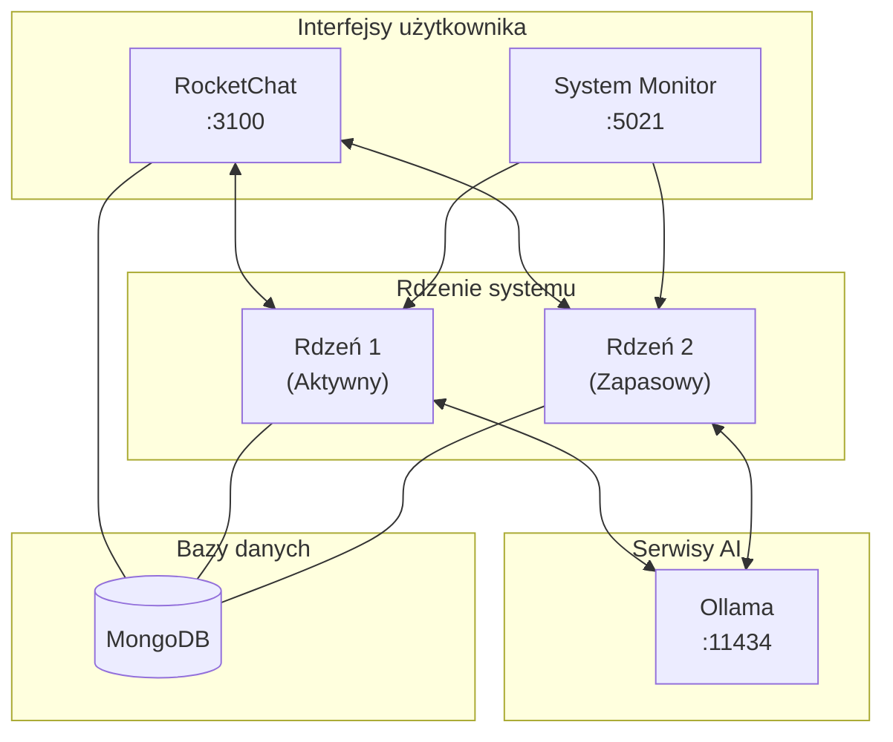

# Dokumentacja Systemu Heyken

## Spis treści
1. [Wprowadzenie](#wprowadzenie)
2. [Architektura systemu](#architektura-systemu)
3. [Komponenty systemu](#komponenty-systemu)
4. [Funkcje zaimplementowane](#funkcje-zaimplementowane)
5. [Przykłady użycia](#przykłady-użycia)
6. [Zadania do zrobienia (TODO)](#zadania-do-zrobienia-todo)
7. [Rozwiązywanie problemów](#rozwiązywanie-problemów)

## Wprowadzenie

Heyken to kompleksowy system autonomicznego programowania zaprojektowany z myślą o niezawodności i samorozwoju. System wykorzystuje architekturę dwóch redundantnych rdzeni, które zapewniają ciągłość działania nawet w przypadku awarii jednego z nich.

Główne cechy systemu Heyken:
- **Lokalność i niezależność** - działa lokalnie, bez uzależnienia od zewnętrznych usług
- **Redundantna architektura** - dwa rdzenie zapewniające ciągłość działania
- **Piaskownica (Sandbox)** - środowisko testowe do bezpiecznego eksperymentowania
- **Integracja komunikacji** - pełna integracja z RocketChat i GitLab
- **Zdolność do samorozwoju** - możliwość uczenia się i rozwijania nowych funkcjonalności
- **Pełna kontrola nad danymi** - wszystkie dane pozostają w lokalnej infrastrukturze

## Architektura systemu

System Heyken składa się z następujących głównych komponentów:

1. **Interfejsy użytkownika**:
   - RocketChat (port 3100) - główny interfejs komunikacyjny
   - System Monitor (port 5021) - monitorowanie stanu systemu

2. **Rdzenie systemu**:
   - Rdzeń 1 (aktywny) - główny rdzeń zarządzający systemem
   - Rdzeń 2 (zapasowy) - rdzeń zapasowy, gotowy do przejęcia kontroli

3. **Serwisy AI**:
   - Ollama (port 11434) - lokalny serwer modeli AI

4. **Bazy danych**:
   - MongoDB - baza danych dla RocketChat i logów systemowych



## Komponenty systemu

### RocketChat

RocketChat służy jako główny interfejs komunikacyjny systemu Heyken. Użytkownicy mogą komunikować się z botem Heyken poprzez wiadomości w kanałach lub bezpośrednio.

**Dane logowania**:
- Administrator: admin / dxIsDLnhiqKfDt5J
- Bot Heyken: heyken_bot / heyken123
- Użytkownik: heyken_user / user123

### Ollama

Ollama to lokalny serwer modeli AI, który dostarcza możliwości generowania tekstu, kodu i innych treści. System Heyken korzysta z modelu llama3 do przetwarzania zapytań użytkowników.

### Bot Heyken

Bot Heyken to główny interfejs komunikacyjny między użytkownikiem a systemem. Bot obsługuje wiadomości z RocketChat, przetwarza je za pomocą Ollama i zwraca odpowiedzi.

## Funkcje zaimplementowane

### 1. Obsługa wiadomości z RocketChat

Bot Heyken potrafi:
- Odbierać wiadomości z kanałów i wiadomości bezpośrednich
- Filtrować wiadomości, aby odpowiadać tylko na te skierowane do bota
- Śledzić już odpowiedziane wiadomości, aby unikać duplikatów

Przykładowy kod:
```python
def _process_messages(self):
    """
    Przetwarza wiadomości z RocketChat.
    """
    messages = self.rocketchat.get_new_messages()
    logger.info(f"Otrzymano {len(messages)} nowych wiadomości")
    
    for message in messages:
        message_id = message.get("_id", "")
        
        # Pomijaj wiadomości, na które już odpowiedziano
        if message_id in self.answered_messages:
            continue
            
        # Przetwarzaj wiadomość
        self._handle_message(message)
        
        # Dodaj wiadomość do już odpowiedzianych
        self.answered_messages.add(message_id)
```

### 2. Zarządzanie statusem bota

Bot potrafi zarządzać swoim statusem w RocketChat:
- Ustawiać status "online" gdy jest gotowy do pracy
- Ustawiać status "zajęty" podczas przetwarzania zapytań
- Wyświetlać informację o aktualnie wykonywanym zadaniu w statusie

Przykładowy kod:
```python
def set_status_busy(self, status_text="Pracuję..."):
    """
    Ustawia status bota na zajęty z określonym tekstem.
    
    Args:
        status_text: Tekst statusu
    """
    data = {
        "userId": self.user_id,
        "message": status_text,
        "status": "busy"
    }
    response = self._make_request("POST", "users.setStatus", data)
    logger.info(f"Ustawiono status na 'zajęty' z komunikatem: {status_text}")
    return response
```

### 3. Szacowanie czasu odpowiedzi

Bot potrafi oszacować czas potrzebny na odpowiedź na podstawie:
- Długości zapytania
- Aktualnego obciążenia systemu (CPU, pamięć)
- Historycznych danych o czasie przetwarzania

Przykładowy kod:
```python
def _estimate_response_time(self, text_length):
    """
    Szacuje czas odpowiedzi na podstawie długości tekstu i aktualnego obciążenia.
    
    Args:
        text_length: Długość tekstu zapytania
            
    Returns:
        int: Szacowany czas odpowiedzi w sekundach
    """
    # Podstawowy czas przetwarzania
    base_time = 5
    
    # Dodatkowy czas w zależności od długości tekstu
    # Załóżmy, że każde 100 znaków dodaje 2 sekundy
    length_factor = text_length // 100 * 2
    
    # Sprawdź obciążenie systemu
    try:
        import psutil
        cpu_usage = psutil.cpu_percent(interval=0.1)
        memory_usage = psutil.virtual_memory().percent
        
        # Dodatkowy czas w zależności od obciążenia CPU i pamięci
        system_factor = (cpu_usage + memory_usage) // 20
    except ImportError:
        # Jeśli nie można zaimportować psutil, użyj domyślnej wartości
        system_factor = 2
        
    # Oblicz całkowity szacowany czas
    estimated_time = base_time + length_factor + system_factor
    
    # Dodaj losowy czynnik, aby uniknąć zbyt precyzyjnych szacunków
    import random
    random_factor = random.randint(-2, 2)
    estimated_time += random_factor
    
    # Upewnij się, że szacowany czas jest co najmniej 3 sekundy
    return max(3, estimated_time)
```

### 4. Cytowanie poprzednich wiadomości

Bot potrafi cytować poprzednie wiadomości podczas odpowiadania, co zapewnia kontekst i ułatwia śledzenie konwersacji.

Przykładowy kod:
```python
# Jeśli to nie jest odpowiedź na ostatnią wiadomość, dodaj cytat
if not is_last_message:
    # Dodaj cytat z oryginalnej wiadomości
    quoted_text = text.replace('\n', '\n> ')
    final_response = f"**W odpowiedzi na:** _{message['sender_username']}:_ \
> {quoted_text}\n\n{response}"
    logger.info("Dodano cytat do odpowiedzi, ponieważ to nie jest ostatnia wiadomość")
```

### 5. Informowanie o postępie przetwarzania

Bot informuje użytkownika o rozpoczęciu przetwarzania zapytania i szacowanym czasie odpowiedzi.

Przykładowy kod:
```python
# Przygotuj wiadomość z informacją o czasie odpowiedzi
quoted_text = text.replace('\n', '\n> ')
processing_message = f"**Przetwarzam pytanie:** \
> {quoted_text}\n\nSzacowany czas odpowiedzi: około {estimated_time} sekund."

# Wyślij wiadomość o rozpoczęciu przetwarzania
logger.info(f"Wysyłam informację o rozpoczęciu przetwarzania, szacowany czas: {estimated_time} sekund")
self.rocketchat.send_message(message["room_id"], processing_message)
```

## Przykłady użycia

### Przykład 1: Proste zapytanie do bota

**Użytkownik**:
```
@heyken_bot Co to jest Docker?
```

**Bot** (zmienia status na "Pracuję nad: Co to jest Docker?"):
```
**Przetwarzam pytanie:** 
> Co to jest Docker?

Szacowany czas odpowiedzi: około 7 sekund.
```

**Bot** (po przetworzeniu, zmienia status na "online"):
```
Docker to platforma do tworzenia, wdrażania i uruchamiania aplikacji w kontenerach. Kontenery to lekkie, przenośne jednostki, które zawierają wszystko, co potrzebne do uruchomienia aplikacji: kod, biblioteki, narzędzia systemowe i zależności.

Główne zalety Dockera:
1. Izolacja - aplikacje działają w odizolowanych środowiskach
2. Przenośność - kontenery działają tak samo na każdym środowisku
3. Efektywność - kontenery są lżejsze niż maszyny wirtualne
4. Skalowalność - łatwe skalowanie aplikacji

Czy chciałbyś dowiedzieć się więcej o konkretnym aspekcie Dockera?
```

### Przykład 2: Obsługa wielu wiadomości

**Użytkownik 1**:
```
@heyken_bot Jak zainstalować Dockera na Ubuntu?
```

**Bot** (zmienia status na "Pracuję nad: Jak zainstalować Dockera na Ubuntu?"):
```
**Przetwarzam pytanie:** 
> Jak zainstalować Dockera na Ubuntu?

Szacowany czas odpowiedzi: około 10 sekund.
```

**Użytkownik 2** (w międzyczasie):
```
@heyken_bot Co to jest kontener?
```

**Bot** (odpowiada najpierw na pierwsze pytanie, zmienia status na "online"):
```
Aby zainstalować Dockera na Ubuntu, wykonaj następujące kroki:

1. Zaktualizuj repozytoria:
   ```bash
   sudo apt update
   ```

2. Zainstaluj wymagane pakiety:
   ```bash
   sudo apt install apt-transport-https ca-certificates curl software-properties-common
   ```

3. Dodaj klucz GPG Dockera:
   ```bash
   curl -fsSL https://download.docker.com/linux/ubuntu/gpg | sudo apt-key add -
   ```

4. Dodaj repozytorium Dockera:
   ```bash
   sudo add-apt-repository "deb [arch=amd64] https://download.docker.com/linux/ubuntu $(lsb_release -cs) stable"
   ```

5. Zaktualizuj repozytoria:
   ```bash
   sudo apt update
   ```

6. Zainstaluj Dockera:
   ```bash
   sudo apt install docker-ce
   ```

7. Sprawdź instalację:
   ```bash
   sudo docker run hello-world
   ```

Czy potrzebujesz dodatkowych informacji?
```

**Bot** (zmienia status na "Pracuję nad: Co to jest kontener?"):
```
**Przetwarzam pytanie:** 
> Co to jest kontener?

Szacowany czas odpowiedzi: około 6 sekund.
```

**Bot** (odpowiada na drugie pytanie, cytując je):
```
**W odpowiedzi na:** _użytkownik2:_ 
> Co to jest kontener?

Kontener to standardowa jednostka oprogramowania, która pakuje kod i wszystkie jego zależności, dzięki czemu aplikacja działa szybko i niezawodnie w różnych środowiskach komputerowych.

Kontenery:
1. Zawierają wszystko potrzebne do uruchomienia aplikacji: kod, biblioteki, zależności
2. Są izolowane od innych kontenerów i systemu hosta
3. Współdzielą jądro systemu operacyjnego, ale działają w odizolowanych procesach
4. Są lżejsze niż maszyny wirtualne, ponieważ nie potrzebują pełnego systemu operacyjnego
5. Mogą być uruchamiane na każdym systemie, który obsługuje technologię kontenerów

Kontenery są kluczowym elementem w nowoczesnym rozwoju oprogramowania, szczególnie w architekturach mikrousługowych i wdrożeniach chmurowych.
```

## Zadania do zrobienia (TODO)

### 1. Rozszerzenie funkcjonalności bota

- [ ] Implementacja obsługi komend specjalnych (np. `/help`, `/status`, `/restart`)
- [ ] Dodanie możliwości zarządzania projektami przez bota
- [ ] Implementacja automatycznego generowania dokumentacji
- [ ] Dodanie możliwości generowania kodu na podstawie opisu

### 2. Ulepszenia interfejsu użytkownika

- [ ] Stworzenie webowego interfejsu do monitorowania statusu systemu
- [ ] Implementacja powiadomień o postępie długotrwałych zadań
- [ ] Dodanie wizualizacji danych i diagramów w odpowiedziach bota

### 3. Optymalizacja wydajności

- [ ] Implementacja mechanizmu cache dla często używanych odpowiedzi
- [ ] Optymalizacja pobierania wiadomości z RocketChat
- [ ] Dodanie mechanizmu priorytetyzacji wiadomości

### 4. Rozszerzenie integracji

- [ ] Integracja z GitLab do zarządzania kodem
- [ ] Dodanie możliwości uruchamiania skryptów w piaskownicy
- [ ] Implementacja mechanizmu automatycznego testowania kodu

### 5. Bezpieczeństwo i niezawodność

- [ ] Implementacja mechanizmu automatycznego przełączania między rdzeniami
- [ ] Dodanie monitorowania stanu systemu i automatycznego powiadamiania o problemach
- [ ] Implementacja mechanizmu kopii zapasowych i przywracania systemu

## Rozwiązywanie problemów

### Problem: Bot nie odpowiada na wiadomości

**Możliwe przyczyny**:
1. RocketChat nie jest uruchomiony lub nie jest dostępny
2. Bot nie jest zalogowany do RocketChat
3. Ollama nie jest uruchomione lub nie jest dostępne
4. Model llama3 nie jest dostępny w Ollama

**Rozwiązanie**:
1. Sprawdź status RocketChat: `docker ps | grep rocketchat`
2. Sprawdź logi bota: `cat /home/tom/github/tom-sapletta-com/evodev/heyken/bot.log`
3. Sprawdź status Ollama: `docker ps | grep ollama`
4. Upewnij się, że model llama3 jest dostępny: `curl http://localhost:11434/api/tags`

### Problem: Długi czas uruchamiania systemu

**Możliwe przyczyny**:
1. Pobieranie modelu llama3 przy każdym uruchomieniu
2. Długi czas inicjalizacji RocketChat
3. Problemy z bazą danych MongoDB

**Rozwiązanie**:
1. Pobierz model llama3 przed uruchomieniem Dockera
2. Zmodyfikuj skrypt `run.sh`, aby pokazywał logi z uruchamiania
3. Sprawdź logi MongoDB: `docker logs rocketchat-mongodb-1`

### Problem: Bot odpowiada wielokrotnie na tę samą wiadomość

**Możliwe przyczyny**:
1. Nieprawidłowe śledzenie już odpowiedzianych wiadomości
2. Problemy z timestampami w RocketChat

**Rozwiązanie**:
1. Sprawdź implementację śledzenia odpowiedzianych wiadomości w metodzie `_process_messages`
2. Upewnij się, że timestampy są prawidłowo konwertowane z formatu RocketChat

---

Dokumentacja została stworzona: 2025-05-07
