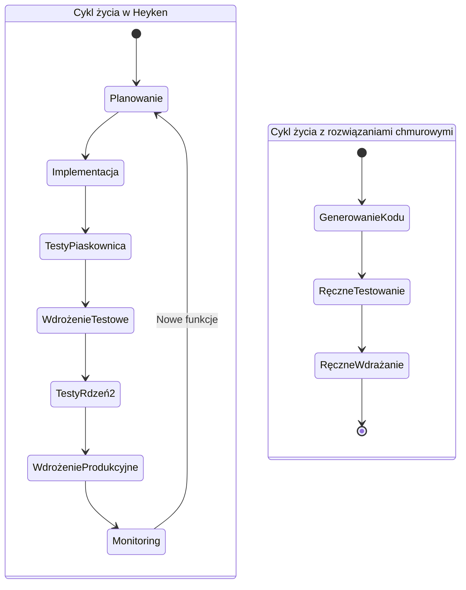

# Porównanie techniczne Heyken z innymi rozwiązaniami AI

## Architektura techniczna

### Heyken vs Rozwiązania Chmurowe

```mermaid
flowchart TB
    subgraph "Heyken - Architektura lokalna"
        subgraph "Warstwa prezentacji"
            RC[RocketChat]
            GL[GitLab UI]
        end
        
        subgraph "Warstwa logiki biznesowej"
            C1["Rdzeń 1"]
            C2["Rdzeń 2"]
            SB["Piaskownica"]
        end
        
        subgraph "Warstwa AI"
            OL[Ollama]
            LM["Lokalne modele LLM"]
        end
        
        subgraph "Warstwa danych"
            MDB[(MongoDB)]
            PG[(PostgreSQL)]
        end
        
        RC <--> C1 & C2
        GL <--> C1 & C2
        C1 <--> OL
        C2 <--> OL
        C1 & C2 <--> SB
        OL --- LM
        C1 & C2 & SB --- MDB & PG
    end
    
    subgraph "Rozwiązania chmurowe (ChatGPT, Devin, Copilot)"
        subgraph "Interfejs użytkownika"
            UI[Web UI/IDE Plugin]
        end
        
        subgraph "Serwery API"
            API[API Gateway]
            Auth[Autoryzacja]
        end
        
        subgraph "Przetwarzanie"
            LLM[Modele LLM]
            Inf[Infrastruktura inferencji]
        end
        
        subgraph "Dane"
            DB[(Bazy danych)]
            S3[(Magazyn danych)]
        end
        
        UI <--> API
        API <--> Auth
        API <--> LLM
        LLM <--> Inf
        LLM & Inf <--> DB & S3
    end
    
    style Heyken fill:#f5f5ff,stroke:#8888ff,stroke-width:2px
    style "Rozwiązania chmurowe (ChatGPT, Devin, Copilot)" fill:#fff5f5,stroke:#ff8888,stroke-width:2px
```

## Kluczowe różnice techniczne

### 1. Architektura systemu

| Aspekt | Heyken | Rozwiązania chmurowe (Devin, ChatGPT, Copilot) |
|--------|--------|------------------------------------------------|
| **Topologia** | Rozproszona z redundancją | Monolityczna lub mikroserwisowa w chmurze |
| **Skalowalność** | Wertykalna (na pojedynczym serwerze) | Horyzontalna (przez dodawanie instancji) |
| **Dostępność** | Wysoka dzięki redundantnym rdzeniom | Zależna od SLA dostawcy chmury |
| **Latencja** | Minimalna (lokalna sieć) | Wyższa (zależna od połączenia internetowego) |
| **Izolacja** | Pełna (prywatna sieć) | Ograniczona (współdzielona infrastruktura) |

### 2. Przetwarzanie AI

| Aspekt | Heyken | Rozwiązania chmurowe |
|--------|--------|----------------------|
| **Modele** | Lokalne (Ollama, llama3) | Własnościowe (GPT-4, Claude, itp.) |
| **Dostosowanie** | Możliwość fine-tuningu | Ograniczone (tylko przez API) |
| **Kontrola wersji** | Pełna | Brak (aktualizacje po stronie dostawcy) |
| **Przepustowość** | Ograniczona mocą lokalnego sprzętu | Wysoka, ale z limitami API |
| **Offline** | Pełna funkcjonalność | Brak funkcjonalności |

### 3. Integracja z ekosystemem deweloperskim

```mermaid
flowchart LR
    subgraph "Heyken - Integracja"
        RC[RocketChat]
        GL[GitLab]
        OL[Ollama]
        DB[(Bazy danych)]
        
        RC <--> GL
        RC <--> OL
        GL <--> DB
        OL <--> DB
    end
    
    subgraph "Rozwiązania chmurowe - Integracja"
        API[API]
        SDK[SDK]
        Plugins[Pluginy]
        
        API --> SDK
        SDK --> Plugins
        Plugins --> "Zewnętrzne\nnarzędzia"
    end
    
    style "Heyken - Integracja" fill:#f5f5ff,stroke:#8888ff,stroke-width:2px
    style "Rozwiązania chmurowe - Integracja" fill:#fff5f5,stroke:#ff8888,stroke-width:2px
```

| Aspekt | Heyken | Rozwiązania chmurowe |
|--------|--------|----------------------|
| **Integracja z VCS** | Natywna (GitLab) | Przez API/pluginy |
| **Komunikacja** | Wbudowana (RocketChat) | Zewnętrzna |
| **CI/CD** | Wbudowane | Zewnętrzne |
| **Rozszerzalność** | Otwarta architektura | Zamknięta, ograniczona do API |
| **Customizacja** | Pełna | Ograniczona |

### 4. Bezpieczeństwo i prywatność danych

| Aspekt | Heyken | Rozwiązania chmurowe |
|--------|--------|----------------------|
| **Lokalizacja danych** | Lokalny serwer | Chmura dostawcy |
| **Kontrola dostępu** | Pełna | Ograniczona |
| **Audyt** | Pełny wgląd w logi | Ograniczony |
| **Szyfrowanie** | Konfigurowalne | Predefiniowane |
| **Zgodność z regulacjami** | Łatwiejsza (dane na miejscu) | Trudniejsza (dane u dostawcy) |

### 5. Cykl życia oprogramowania



| Aspekt | Heyken | Rozwiązania chmurowe |
|--------|--------|----------------------|
| **Automatyzacja** | Pełna (od planowania po wdrożenie) | Częściowa (głównie generowanie kodu) |
| **Testowanie** | Automatyczne w piaskownicy | Ręczne lub zewnętrzne |
| **Wdrażanie** | Automatyczne z walidacją | Ręczne |
| **Monitoring** | Wbudowany | Zewnętrzny |
| **Ciągłość** | Pełna historia projektu | Fragmentaryczna |

## Scenariusze użycia i wydajność

### 1. Tworzenie nowego projektu

| Kryterium | Heyken | Devin | ChatGPT/Claude | GitHub Copilot |
|-----------|--------|-------|---------------|----------------|
| **Czas setup-u** | Niski (automatyczny) | Średni | Wysoki (ręczny) | Wysoki (ręczny) |
| **Jakość architektury** | Wysoka (wzorce) | Średnia | Zmienna | Niska (fragmenty) |
| **Spójność kodu** | Wysoka | Średnia | Niska | Niska |
| **Dokumentacja** | Automatyczna | Podstawowa | Ręczna | Brak |
| **Testy** | Automatyczne | Podstawowe | Ręczne | Brak |

### 2. Utrzymanie istniejącego projektu

| Kryterium | Heyken | Devin | ChatGPT/Claude | GitHub Copilot |
|-----------|--------|-------|---------------|----------------|
| **Zrozumienie kodu** | Pełne (stały kontekst) | Częściowe | Ograniczone | Lokalne (plik) |
| **Refaktoryzacja** | Kompleksowa | Częściowa | Fragmentaryczna | Lokalna |
| **Naprawa błędów** | Proaktywna | Reaktywna | Reaktywna | Sugestie |
| **Aktualizacje zależności** | Automatyczne | Ręczne | Ręczne | Brak |
| **Migracje** | Automatyczne | Ręczne | Ręczne | Brak |

### 3. Skalowalność projektu

| Kryterium | Heyken | Devin | ChatGPT/Claude | GitHub Copilot |
|-----------|--------|-------|---------------|----------------|
| **Wielkość projektu** | Nieograniczona | Ograniczona | Bardzo ograniczona | Lokalna |
| **Zespół** | Współpraca | Indywidualna | Indywidualna | Indywidualna |
| **Mikrousługi** | Natywne wsparcie | Ograniczone | Brak | Brak |
| **Monorepo** | Natywne wsparcie | Ograniczone | Brak | Brak |
| **Wielojęzyczność** | Pełna | Ograniczona | Ograniczona | Ograniczona |

## Analiza techniczna przypadków użycia

### Przypadek 1: Projekt z wysokimi wymaganiami bezpieczeństwa

```mermaid
flowchart TB
    subgraph "Heyken - Bezpieczne środowisko"
        PrivNet["Sieć prywatna"]
        IsoEnv["Izolowane środowisko"]
        LocalAI["Lokalne modele AI"]
        AuditLog["Pełne logi audytowe"]
        
        PrivNet --> IsoEnv
        IsoEnv --> LocalAI
        IsoEnv --> AuditLog
    end
    
    subgraph "Rozwiązania chmurowe"
        PubAPI["Publiczne API"]
        CloudInf["Infrastruktura chmurowa"]
        SharedRes["Współdzielone zasoby"]
        LimitedLog["Ograniczone logi"]
        
        PubAPI --> CloudInf
        CloudInf --> SharedRes
        CloudInf --> LimitedLog
    end
    
    Wymagania["Wymagania bezpieczeństwa:\n- Dane wrażliwe\n- Zgodność z regulacjami\n- Audytowalność\n- Izolacja"]
    
    Wymagania --> "Heyken - Bezpieczne środowisko"
    Wymagania -. "Niedopasowanie" .-> "Rozwiązania chmurowe"
    
    style "Heyken - Bezpieczne środowisko" fill:#e6ffe6,stroke:#00aa00,stroke-width:2px
    style "Rozwiązania chmurowe" fill:#ffe6e6,stroke:#aa0000,stroke-width:2px
```

### Przypadek 2: Ciągła integracja i wdrażanie (CI/CD)

```mermaid
flowchart LR
    subgraph "Heyken CI/CD"
        Code["Kod źródłowy"]
        SandboxTest["Testy w piaskownicy"]
        AutoDeploy["Automatyczne wdrożenie"]
        Monitor["Monitoring i rollback"]
        
        Code --> SandboxTest
        SandboxTest --> AutoDeploy
        AutoDeploy --> Monitor
        Monitor -.-> Code
    end
    
    subgraph "Tradycyjne CI/CD z AI"
        AICode["Kod z AI"]
        ManualTest["Ręczne testy"]
        ExtCI["Zewnętrzny CI/CD"]
        ManualMonitor["Ręczny monitoring"]
        
        AICode --> ManualTest
        ManualTest --> ExtCI
        ExtCI --> ManualMonitor
    end
    
    style "Heyken CI/CD" fill:#e6f7ff,stroke:#0088cc,stroke-width:2px
    style "Tradycyjne CI/CD z AI" fill:#fff7e6,stroke:#cc8800,stroke-width:2px
```

## Podsumowanie techniczne

Heyken oferuje unikalne podejście techniczne, które wyróżnia go na tle innych rozwiązań AI:

1. **Architektura z redundantnymi rdzeniami** zapewnia niezawodność i ciągłość działania niedostępną w innych rozwiązaniach.

2. **Lokalne przetwarzanie AI** eliminuje zależność od zewnętrznych dostawców i zapewnia pełną kontrolę nad modelami.

3. **Zintegrowany ekosystem deweloperski** łączy komunikację, zarządzanie kodem i CI/CD w jednym spójnym środowisku.

4. **Piaskownica jako środowisko testowe** umożliwia bezpieczne eksperymentowanie i walidację przed wdrożeniem.

5. **Pełna automatyzacja cyklu życia oprogramowania** od planowania po wdrożenie i monitoring.

Te cechy techniczne czynią Heyken idealnym rozwiązaniem dla organizacji, które:
- Wymagają pełnej kontroli nad danymi i kodem
- Potrzebują wysokiej niezawodności i dostępności
- Chcą zautomatyzować cały proces wytwarzania oprogramowania
- Muszą spełniać rygorystyczne wymagania bezpieczeństwa i zgodności
- Dążą do zwiększenia efektywności zespołów deweloperskich

---

*Dokument techniczny wygenerowany: 7 maja 2025*
