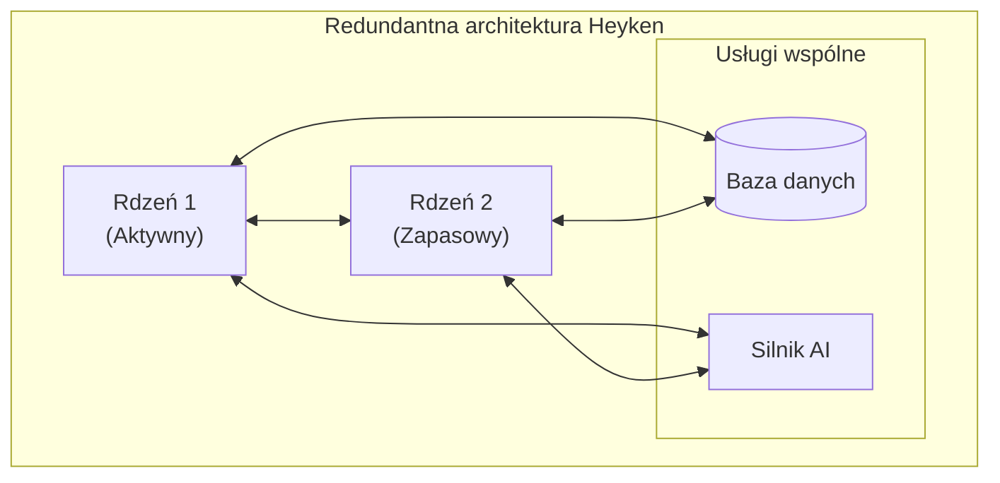

# Porównanie Heyken z innymi rozwiązaniami AI

## Spis treści
1. [Wprowadzenie](#wprowadzenie)
2. [Porównanie funkcjonalności](#porównanie-funkcjonalności)
3. [Unikalne cechy Heyken](#unikalne-cechy-heyken)
4. [Szczegółowe porównanie z popularnymi rozwiązaniami](#szczegółowe-porównanie-z-popularnymi-rozwiązaniami)
5. [Przypadki użycia](#przypadki-użycia)
6. [Podsumowanie](#podsumowanie)

## Wprowadzenie

Heyken to innowacyjny system autonomicznego programowania, który wyróżnia się na tle innych rozwiązań AI dostępnych na rynku. W przeciwieństwie do większości narzędzi AI, Heyken działa lokalnie, zapewniając pełną kontrolę nad danymi i procesami, jednocześnie oferując zaawansowane funkcje automatyzacji i samorozwoju.

Ten dokument porównuje Heyken z innymi popularnymi rozwiązaniami AI, takimi jak Devin, ChatGPT, Claude i GitHub Copilot, podkreślając unikalne cechy i przewagi Heyken.

## Porównanie funkcjonalności

| Funkcjonalność | Heyken | Devin | ChatGPT | Claude | GitHub Copilot |
|---------------|--------|-------|---------|--------|----------------|
| **Lokalność działania** | ✅ | ❌ | ❌ | ❌ | ❌ |
| **Redundantna architektura** | ✅ | ❌ | ❌ | ❌ | ❌ |
| **Piaskownica testowa** | ✅ | ✅ | ❌ | ❌ | ❌ |
| **Integracja z komunikacją** | ✅ (RocketChat) | ❌ | ❌ | ❌ | ❌ |
| **Integracja z zarządzaniem kodem** | ✅ (GitLab) | ✅ | ❌ | ❌ | ✅ |
| **Zdolność do samorozwoju** | ✅ | ❌ | ❌ | ❌ | ❌ |
| **Pełna kontrola nad danymi** | ✅ | ❌ | ❌ | ❌ | ❌ |
| **Generowanie kodu** | ✅ | ✅ | ✅ | ✅ | ✅ |
| **Automatyzacja testowania** | ✅ | ✅ | ❌ | ❌ | ❌ |
| **Zarządzanie projektami** | ✅ | ✅ | ❌ | ❌ | ❌ |
| **Szacowanie czasu odpowiedzi** | ✅ | ❌ | ❌ | ❌ | ❌ |
| **Dynamiczna infrastruktura** | ✅ | ❌ | ❌ | ❌ | ❌ |

## Unikalne cechy Heyken

### 1. Redundantna architektura z dwoma rdzeniami

Heyken wykorzystuje architekturę dwóch redundantnych rdzeni, które zapewniają ciągłość działania nawet w przypadku awarii jednego z nich. Ta unikalna cecha zapewnia niezawodność systemu i minimalizuje ryzyko przestojów.

### 2. Piaskownica jako środowisko eksperymentalne

Heyken posiada dedykowane środowisko piaskownicy (sandbox), które umożliwia bezpieczne testowanie nowych funkcjonalności i rozwiązań bez wpływu na główny system. Ta cecha pozwala na eksperymentowanie i rozwój systemu bez ryzyka.

### 3. Pełna integracja komunikacji i zarządzania kodem

Heyken integruje się z RocketChat jako platformą komunikacyjną oraz GitLab jako systemem zarządzania kodem. Ta integracja zapewnia kompleksowe środowisko do współpracy, komunikacji i rozwoju oprogramowania.

### 4. Zdolność do samorozwoju

Jedną z najbardziej unikalnych cech Heyken jest zdolność do samorozwoju. System może samodzielnie tworzyć, testować i wdrażać nowe funkcjonalności, ucząc się na podstawie interakcji z użytkownikami i analizy własnych działań.

### 5. Lokalność i niezależność od zewnętrznych usług

Heyken działa lokalnie, bez uzależnienia od zewnętrznych usług chmurowych. Ta cecha zapewnia pełną kontrolę nad danymi, procesami i infrastrukturą, eliminując problemy związane z prywatnością danych i dostępnością usług.

### 6. Pełna kontrola nad danymi i bezpieczeństwem

Dzięki lokalności działania, Heyken zapewnia pełną kontrolę nad danymi i bezpieczeństwem. Wszystkie dane pozostają w lokalnej infrastrukturze, eliminując ryzyko wycieku danych i zapewniając zgodność z przepisami o ochronie danych.

## Szczegółowe porównanie z popularnymi rozwiązaniami

### Heyken vs Devin

**Devin** to autonomiczny agent AI do tworzenia oprogramowania, który może planować, pisać i debugować kod. W przeciwieństwie do Heyken, Devin działa w chmurze i nie oferuje redundantnej architektury ani pełnej kontroli nad danymi.

**Kluczowe różnice**:
- Heyken działa lokalnie, Devin w chmurze
- Heyken oferuje redundantną architekturę, Devin nie
- Heyken integruje się z RocketChat i GitLab, Devin ma własny interfejs
- Heyken zapewnia pełną kontrolę nad danymi, Devin nie

### Heyken vs ChatGPT

**ChatGPT** to model językowy AI, który może generować kod i odpowiadać na pytania programistyczne. W przeciwieństwie do Heyken, ChatGPT nie oferuje dedykowanego środowiska do testowania kodu, integracji z systemami zarządzania kodem ani zdolności do samorozwoju.

**Kluczowe różnice**:
- Heyken to kompleksowy system autonomicznego programowania, ChatGPT to model językowy
- Heyken działa lokalnie, ChatGPT w chmurze
- Heyken oferuje piaskownicę testową, ChatGPT nie
- Heyken integruje się z systemami zarządzania kodem, ChatGPT nie

### Heyken vs Claude

**Claude** to model językowy AI podobny do ChatGPT, ale z większym naciskiem na bezpieczeństwo i etykę. Podobnie jak w przypadku ChatGPT, Claude nie oferuje dedykowanego środowiska do testowania kodu, integracji z systemami zarządzania kodem ani zdolności do samorozwoju.

**Kluczowe różnice**:
- Heyken to kompleksowy system autonomicznego programowania, Claude to model językowy
- Heyken działa lokalnie, Claude w chmurze
- Heyken oferuje piaskownicę testową, Claude nie
- Heyken integruje się z systemami zarządzania kodem, Claude nie

### Heyken vs GitHub Copilot

**GitHub Copilot** to narzędzie AI do generowania kodu, które integruje się z edytorami kodu. W przeciwieństwie do Heyken, GitHub Copilot nie oferuje kompleksowego środowiska do testowania kodu, zarządzania projektami ani zdolności do samorozwoju.

**Kluczowe różnice**:
- Heyken to kompleksowy system autonomicznego programowania, GitHub Copilot to narzędzie do generowania kodu
- Heyken działa lokalnie, GitHub Copilot w chmurze
- Heyken oferuje piaskownicę testową, GitHub Copilot nie
- Heyken integruje się z systemami komunikacji, GitHub Copilot nie

## Przypadki użycia

### Przypadek 1: Tworzenie nowego projektu

**Heyken**:
1. Użytkownik opisuje projekt w RocketChat
2. Heyken analizuje wymagania i tworzy plan projektu
3. Heyken generuje strukturę projektu, kod i testy w piaskownicy
4. Heyken testuje kod w piaskownicy
5. Heyken wdraża projekt do GitLab
6. Użytkownik ma pełną kontrolę nad kodem i danymi

**Inne rozwiązania**:
1. Użytkownik opisuje projekt w interfejsie AI
2. AI generuje kod
3. Użytkownik musi ręcznie testować i wdrażać kod
4. Dane i kod są przechowywane w chmurze

### Przypadek 2: Debugowanie istniejącego kodu

**Heyken**:
1. Użytkownik zgłasza problem w RocketChat
2. Heyken analizuje kod w GitLab
3. Heyken identyfikuje problem i generuje rozwiązanie
4. Heyken testuje rozwiązanie w piaskownicy
5. Heyken wdraża poprawkę do GitLab
6. Użytkownik ma pełną kontrolę nad procesem

**Inne rozwiązania**:
1. Użytkownik zgłasza problem w interfejsie AI
2. AI analizuje kod (jeśli ma do niego dostęp)
3. AI sugeruje rozwiązanie
4. Użytkownik musi ręcznie wdrożyć i przetestować rozwiązanie

### Przypadek 3: Automatyzacja procesów

**Heyken**:
1. Użytkownik opisuje proces do automatyzacji w RocketChat
2. Heyken analizuje wymagania i tworzy plan automatyzacji
3. Heyken generuje skrypty i narzędzia automatyzacji
4. Heyken testuje automatyzację w piaskownicy
5. Heyken wdraża automatyzację do infrastruktury
6. Użytkownik ma pełną kontrolę nad procesem i danymi

**Inne rozwiązania**:
1. Użytkownik opisuje proces do automatyzacji w interfejsie AI
2. AI sugeruje rozwiązania
3. Użytkownik musi ręcznie implementować i testować automatyzację

## Podsumowanie

Heyken wyróżnia się na tle innych rozwiązań AI dzięki unikalnym cechom, takim jak redundantna architektura, piaskownica testowa, pełna integracja komunikacji i zarządzania kodem, zdolność do samorozwoju oraz lokalność i niezależność od zewnętrznych usług.

Te cechy czynią Heyken idealnym rozwiązaniem dla organizacji, które cenią sobie kontrolę nad danymi, niezawodność systemów i kompleksowe podejście do automatyzacji procesów programistycznych.

Podczas gdy inne rozwiązania AI mogą oferować podobne funkcje generowania kodu, Heyken zapewnia kompleksowe środowisko do tworzenia, testowania i wdrażania oprogramowania, z naciskiem na bezpieczeństwo, niezawodność i kontrolę.

---

Dokument został stworzony: 2025-05-07
